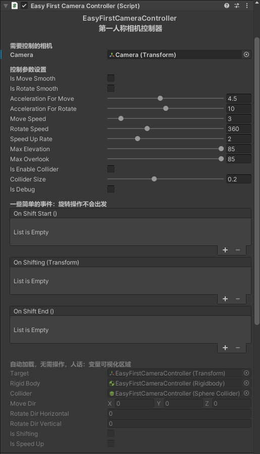
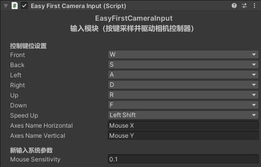

# EasyFirstCameraController

一款简单易用的 Unity 第一人称相机控制器插件，开箱即用：拖入预制体、指定相机即可获得带视角俯仰限制、碰撞检测与平滑过渡的完整第一人称相机控制体验。

## 演示

| 运行总览 | EasyFirstCameraController 属性面板 | EasyFirstCameraInput 属性面板 |
|---|---|---|
|  |  |  |

## 特性

- **新旧输入系统双支持**：默认使用旧输入 API，安装新输入系统包（`com.unity.inputsystem`）后自动切换为 `Keyboard.current` / `Mouse.current`（条件编译 `#if ENABLE_INPUT_SYSTEM`）
- **移动/旋转平滑**：可选平滑插值，加速度可调
- **碰撞检测与高速防穿透**：启用碰撞后使用物理射线检测，支持高速移动下不穿模
- **视角俯仰限制**：仰角/俯角独立限制（默认 85°）
- **移动事件回调**：开始移动、移动中、停止移动三个事件（旋转操作不触发）

## 基础用法

### 使用预制体

1. 将 `Prefabs/EasyFirstCameraController.prefab` 拖入场景
2. 在 Inspector 中把预制体上的 `_camera` 字段拖入你的相机
3. 运行场景，按住鼠标右键，使用 `W/A/S/D` 前后左右移动、`R/F` 上下升降、`LeftShift` 加速、移动鼠标旋转视角


### 新输入系统

1. `Packages/manifest.json` 添加 `com.unity.inputsystem`
2. Project Settings → Player → Active Input Handling 选择 `Both`
3. 代码自动切换，无需修改；新输入系统下可在 Inspector 中调整鼠标灵敏度（默认 `0.1`，对齐旧输入管理器 Mouse 轴默认 Sensitivity）

## API

`EasyFirstCameraController` 公开方法：

```csharp
/// <summary>当前控制目标（相机跟随的载体）</summary>
public Transform Target { get; }

/// <summary>
/// 设置移动方向（世界空间，需归一化，传入 Vector3.zero 停止移动）与是否加速
/// </summary>
public void SetMoveDirection(Vector3 moveDir, bool isSpeedUp);

/// <summary>
/// 设置旋转方向（水平/垂直角速度系数；水平正值向右转，垂直正值向上看）
/// </summary>
public void SetRotateDirection(float horizontal, float vertical);
```
